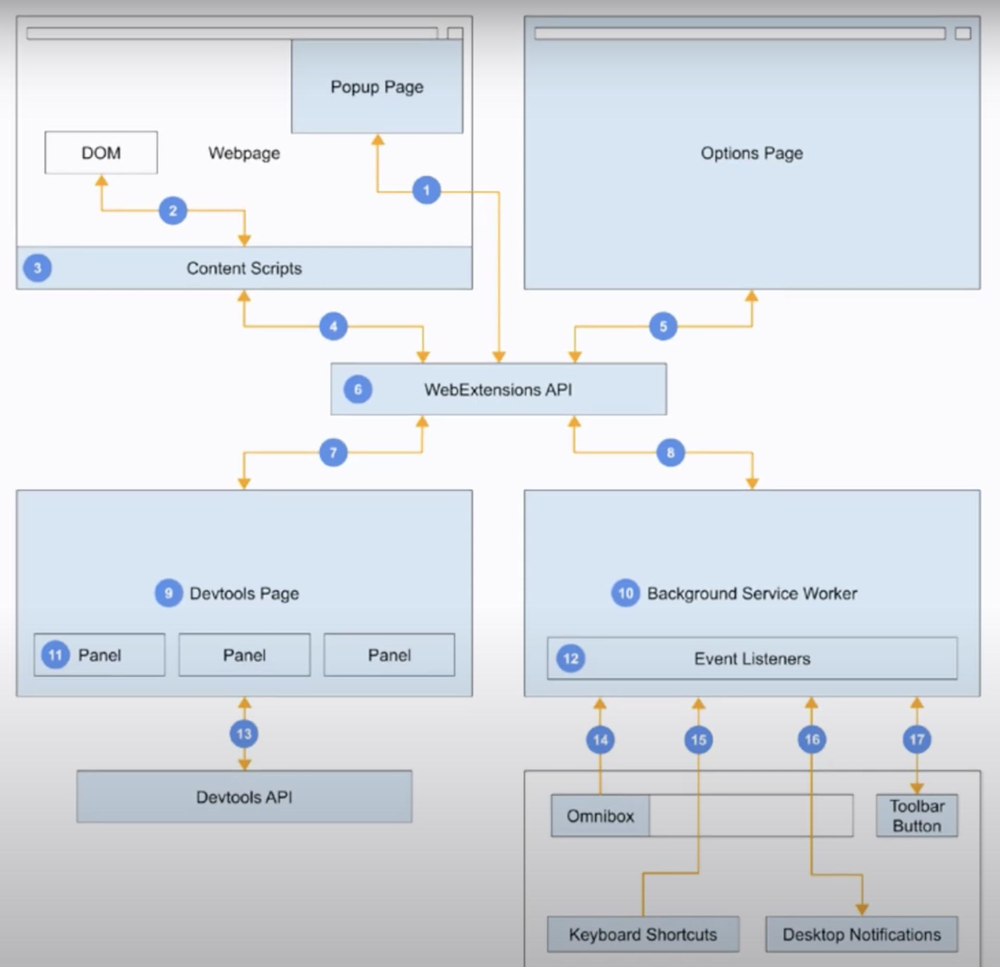
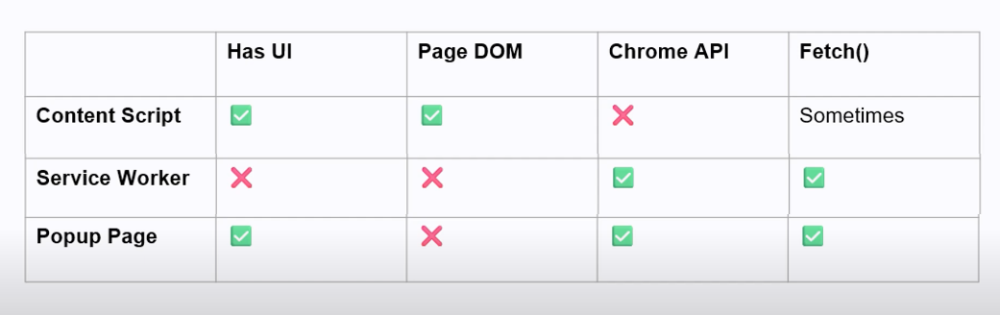
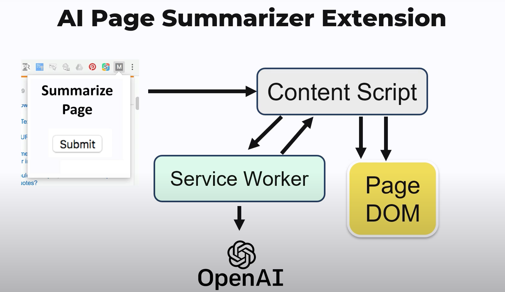

# My Chrome Extension Architecure Permission Exploration

## Chrome Permission Handlers - | Content Script, Popup Page, Service Worker |

 

### Let's talk about each one permission, shall we?
#### **Note if you alr familiar with how Electron IPC works, it is way easier since these guys are passing messages one another to get the task done :)**

* Content Script :
    * Web UI
    * DOM Manipulation
    * Fetch can for sometime due to **website own policy**

* Popup Page : 
    * Web UI
    * Chrome API
    * Fetch

* Service Worker
    * Chrome API
    * Fetch

#### Feel free to have a look at the comparision diagram

## For more understanding, let's have a look at the example of chrome extension project

#### Overall, the purpose of the project is to summarize the text/paragraph in P tag, which then generate a simplied summarize version generated by OpenAI API

* Once submitted, the Content Script gonna to get the paragraph by DOM Manipulation in p tag.
* Not having fetch permission, Content Script gonna pass the message with p tag data to Service Worker to query the regenerated simplied summarize version by OpenAI API
* And again, since not having DOM/Web UI permission, it's gonna pass the message again with the query OPENAI data to Content Script to show the summary version of paragraph by DOM